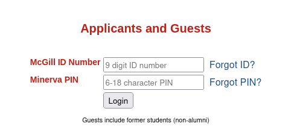

# Get2 Registration

This script automates the registration process for courses at McGill. Joins waitlists if available.
Please follow the instructions below to set up and use the script effectively.

## Setup & Install

1. Clone the GitHub repository to your local machine:

   ```bash
   git clone https://github.com/thabnir/get2.git
   ```

2. Navigate to the repository directory:

   ```bash
   cd get2
   ```

3. Copy the `config.ini.example` file and rename it to `config.ini` (no other name will work). Fill in your Minerva credentials in the `[secrets]` section.

   Example `config.ini`:

   ```ini
   [secrets]
   student_id = 261234567
   minerva_pin = hunter2
   ```

   Make sure to use the right (guest) credentials!
   `student_id` should be set to your 9-digit ID number and `minerva_pin` should be set to your Minerva PIN. If you're not sure what those are, use the resources on [Minerva's login page](https://horizon.mcgill.ca/pban1/twbkwbis.P_WWWLogin) to recover them.
   
   

5. Modify the `courses.ini` file to specify the courses you want to register for. Courses are specified using their term `[YYYYMM]` and their Course Registration Number (CRN), which can be found on [Visual Schedule Builder](https://vsb.mcgill.ca/vsb). Multiple CRNs should be separated by spaces.

   Example `courses.ini`:

   ```ini
   [202409]
   crns = 3495 1992 1973 1969 3484

   [202501]
   crns =

   [202505]
   crns =
   ```

   > Fall 2024 is `[202409]`, Winter 2025 is `[202501]`, Summer 2025 is `[202505]`, and so on

6. Install dependencies using the `requirements.txt` file:

   ```bash
   pip install -r requirements.txt
   ```

## Usage

1. Run the script using Python 3:

   ```bash
   python3 get2.py
   ```

2. The script will use HTTP requests to attempt registration for the courses specified in the `courses.ini` file. If any of the courses are full but have space on their waiting lists, the script will automatically sign you up for the waiting list.

## Troubleshooting

If the script isn't working for some reason:

- Verify that your `config.ini` and `courses.ini` files are present and correctly formatted and spelled
- Verify that your credentials actually work in the [Applicants and Guests](https://horizon.mcgill.ca/pban1/twbkwbis.P_WWWLogin) login page on Minerva
- Check the logs in `get2.log` or the console for debug information.
- Check the `logins/` `registrations/` and `waitlists/` folders to view the pages the script is receiving and debug from there.

## Don't Get Banned

Be mindful not to run the script too frequently to avoid being banned from the registration system. Use the script responsibly and with caution. If you're unsure about the frequency of usage, consider consulting the IT department or referring to their policies regarding automated scripts.

## Notes

- Ensure that you have [Python 3](https://www.python.org/) (and [pip](https://pip.pypa.io/en/stable/installation/)) installed on your system.
- Make sure to keep your Minerva credentials secure.
- Double-check the accuracy of the `courses.ini` file before running the script.
- Make sure you're using the correct set of credentials in `config.ini`, as they're not the normal ones!
- If you encounter any issues or have questions, feel free to reach out to the repository owner or open an issue on GitHub.

Happy course registration! 📚🎓
